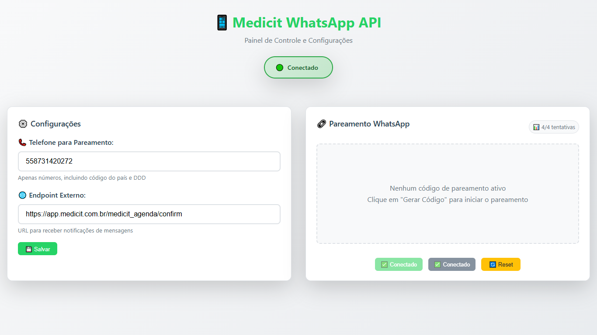

# Medicit WhatsApp API

<div align="center">
  
</div>

### 📁 Estrutura dos Arquivos

```
src/
├── server.ts           # Arquivo principal - coordena todos os módulos
├── config.ts           # Configurações da aplicação
├── logger.ts           # Sistema de logging centralizado
├── initWa.ts           # Inicialização e gerenciamento do WhatsApp/Baileys
├── pairing.ts          # Lógica de pareamento de dispositivos
├── message.ts          # Manipulação de mensagens (envio/recebimento)
├── routes.ts           # Rotas da API Express
├── adminRoutes.ts      # Rotas do painel administrativo
├── external.ts         # Integração com endpoints externos
├── dynamicConfig.ts    # Gerenciamento de configurações dinâmicas
└── shutdown.ts         # Gerenciamento de desligamento graceful
```

## 🆕 Painel de Administração Web

A API agora inclui um **painel de administração web moderno** que permite gerenciar configurações e pareamento através de uma interface visual intuitiva.

### 🔐 Ativação do Painel

Para ativar o painel administrativo, defina a variável `ADMIN_TOKEN` no arquivo `.env`:

```bash
ADMIN_TOKEN=seu_token_seguro_aqui
```

**Comportamentos quando `ADMIN_TOKEN` está definido:**

- ✅ Interface web disponível em `/admin`
- ✅ Configurações podem ser alteradas dinamicamente
- ✅ Pareamento controlado via interface
- ❌ Pareamento automático na inicialização **desabilitado**
- ❌ Endpoint público `/baileys/pair` **bloqueado**

### 🎯 Funcionalidades do Painel

#### ⚙️ Configurações Dinâmicas

- **Telefone de Pareamento**: Altere o número sem reiniciar a aplicação
- **Endpoint Externo**: Configure a URL de webhook em tempo real
- **Persistência**: Configurações salvas sobrescrevem as do `.env`

#### 📱 Controle de Pareamento

- **Código de Pareamento**: Geração manual de códigos de 8 dígitos
- **QR Code**: Geração de QR Code para escaneamento
- **Limite de Tentativas**: Máximo 4 códigos por hora (segurança)
- **Bloqueio Automático**: Após 4 tentativas, apenas QR Code disponível

#### 📊 Monitoramento

- **Status da Conexão**: Visualização em tempo real
- **Feedback Visual**: Alertas e notificações contextuais
- **Contadores**: Tentativas restantes e tempo para reset

### 🌐 Interface Web

Acesse o painel através de: `http://localhost:8000/admin`

## 📋 Descrição dos Módulos

### 🔧 `config.ts`

- **Responsabilidade**: Centraliza todas as configurações da aplicação
- **Conteúdo**:
  - Variáveis de ambiente (PORT, LOG_LEVEL, etc.)
  - **ADMIN_TOKEN**: Token para acesso ao painel administrativo
  - Constantes de pareamento (timeouts, tentativas)
  - Constantes de reconexão
  - Configuração de endpoints externos

### 🆕 `dynamicConfig.ts`

- **Responsabilidade**: Gerenciamento de configurações dinâmicas
- **Funcionalidades**:
  - `updateConfig()` - Atualiza configurações em tempo real
  - `getPairPhone()` - Retorna telefone configurado dinamicamente
  - `getExternalEndpoint()` - Retorna endpoint configurado dinamicamente
  - `addPairingAttempt()` - Registra tentativas de pareamento
  - `canRequestPairingCode()` - Verifica se pode gerar código
  - Sistema de controle de tentativas com janela de tempo

### 🌐 `adminRoutes.ts`

- **Responsabilidade**: Rotas do painel de administração web
- **Rotas**:
  - `GET /admin` - Interface web de administração
  - `POST /admin/auth` - Autenticação com token
  - `GET /admin/config` - Busca configurações atuais
  - `POST /admin/config` - Salva novas configurações
  - `POST /admin/pairing-code` - Gera código de pareamento
  - `POST /admin/qr-code` - Gera QR Code
  - `POST /admin/reset` - Reset da sessão
  - `GET /admin/status` - Status da aplicação
  - `GET /admin/pairing-info` - Informações de tentativas

### 📝 `logger.ts`

- **Responsabilidade**: Sistema de logging unificado
- **Funcionalidades**:
  - `logInfo()` - Logs informativos
  - `logError()` - Logs de erro
  - `logConnectionUpdateFase()` - Logs específicos de conexão
  - `flushPending()` - Processa logs pendentes
  - Sistema de logs pendentes para antes do logger estar pronto

### 🔌 `initWa.ts`

- **Responsabilidade**: Inicialização e gerenciamento do WhatsApp/Baileys
- **Funcionalidades**:
  - `startBaileys()` - Inicializa a conexão WhatsApp
  - `cleanupCurrentSocket()` - Limpeza do socket
  - `resetSession()` - Reset completo da sessão
  - `getConnectionStatus()` - Status da conexão
  - Gerenciamento de reconexões automáticas
  - Processamento de eventos do Baileys

### 🔗 `pairing.ts`

- **Responsabilidade**: Gerenciamento de pareamento de dispositivos
- **Funcionalidades**:
  - `generatePairingCode()` - Gera códigos de pareamento (modo público)
  - `generatePairingCodeAdmin()` - Gera códigos via painel admin
  - `attemptAutoPair()` - Tentativas automáticas (desabilitado no modo admin)
  - `schedulePairingRefresh()` - Agendamento de refresh
  - `isPairingCodeValid()` - Validação de códigos
  - `getPairingStatus()` - Status do pareamento
  - `getPairingInfo()` - Informações de tentativas para painel admin
  - **Controle de tentativas**: Máximo 4 códigos por hora

### 💬 `message.ts`

- **Responsabilidade**: Manipulação de mensagens
- **Funcionalidades**:
  - `enhanceSocketWithMessageLogging()` - Adiciona logging ao socket
  - `formatNumberToJid()` - Formatação de números
  - `extractTextContent()` - Extração de texto
  - `logSimple()` - Log simplificado de mensagens
  - Utilitários para JIDs (isDirectJid, isGroupJid, etc.)

### 🛣️ `routes.ts`

- **Responsabilidade**: Definição das rotas da API
- **Rotas**:
  - `POST /baileys/send-text` - Envio de texto
  - `POST /baileys/send-media` - Envio de mídia
  - `GET /baileys/pair` - Geração de código de pareamento
  - `POST /baileys/reset` - Reset da sessão
  - `GET /baileys/status` - Status da aplicação

### 🌐 `external.ts`

- **Responsabilidade**: Integração com sistemas externos
- **Funcionalidades**:
  - `trySendExternalMessage()` - Envio de mensagens para endpoint externo
  - `trySendExternalStatus()` - Envio de status para endpoint externo
  - `postExternal()` - Função base para requisições externas
  - **Configuração Dinâmica**: Usa endpoint configurado no painel admin

### 🔄 `shutdown.ts`

- **Responsabilidade**: Gerenciamento de desligamento graceful
- **Funcionalidades**:
  - `gracefulShutdown()` - Desligamento limpo
  - `bindProcessSignals()` - Binding de sinais do sistema
  - Preservação/limpeza de sessão baseada no status
  - Timeout de segurança para desligamento forçado

### 🚀 `server.ts`

- **Responsabilidade**: Coordenação geral e inicialização
- **Funcionalidades**:
  - Inicialização do Express e Socket.IO
  - Configuração de CORS
  - Coordenação dos módulos
  - **Modo Admin**: Detecta `ADMIN_TOKEN` e configura interface web
  - Inicialização do logger e WhatsApp
  - Configuração condicional de arquivos estáticos

## 🔄 Fluxo de Funcionamento

1. **Inicialização** (`server.ts`):

   - Cria servidor Express e Socket.IO
   - Inicializa logger
   - Configura rotas
   - Inicia WhatsApp
   - Configura sinais de processo

2. **WhatsApp** (`initWa.ts`):

   - Carrega dependências do Baileys
   - Configura autenticação
   - Processa eventos (conexão, mensagens, etc.)
   - **QR Code via Socket**: Emite QR codes para painel admin
   - Gerencia reconexões automáticas

3. **Pareamento** (`pairing.ts`):

   - **Modo Normal**: Gera códigos automaticamente na inicialização
   - **Modo Admin**: Geração manual via interface web apenas
   - Gerencia cache de códigos
   - **Controle de Tentativas**: Limita códigos a 4 por hora
   - Tentativas automáticas (desabilitadas no modo admin)

4. **Configurações** (`dynamicConfig.ts`):

   - Carrega configurações salvas no arquivo `dynamic-config.json`
   - Permite alteração em tempo real via painel
   - Sobrescreve configurações do `.env`
   - Persiste mudanças no disco

5. **Mensagens** (`message.ts`):

   - Intercepta envios para logging
   - Formata números e JIDs
   - **Integração Dinâmica**: Usa endpoint configurado dinamicamente

6. **Logging** (`logger.ts`):
   - Centraliza todos os logs
   - Gerencia logs pendentes
   - Formatação consistente

## 🔧 Como Usar

### Modo Normal (sem painel admin)

```bash
# Instalação de Dependências
npm install

# Configurar .env (sem ADMIN_TOKEN)
cp .env.example .env

# Desenvolvimento
npm run dev

# Build
npm run build

# Produção
npm start
```

### Modo Administrativo (com painel web)

```bash
# Instalação de Dependências
npm install

# Configurar .env com ADMIN_TOKEN
cp .env.example .env
echo "ADMIN_TOKEN=seu_token_super_seguro" >> .env

# Desenvolvimento
npm run dev

# Acessar painel em http://localhost:8000/admin
```

### 🔑 Configuração do Token Admin

1. **Defina o token no `.env`**:

   ```bash
   ADMIN_TOKEN=meu_token_super_seguro_123
   ```

2. **Acesse o painel**: `http://localhost:8000/admin`

3. **Faça login** com o token configurado

4. **Configure**:

   - 📞 **Telefone**: Número para pareamento (apenas números)
   - 🌐 **Endpoint**: URL para receber webhooks
   - 💾 **Salvar**: Configurações persistem entre reinicializações

5. **Pareamento**:
   - � **Gerar Código**: Código de 6 dígitos para WhatsApp
   - 📷 **Gerar QR**: QR Code para escaneamento
   - 🔄 **Reset**: Limpa sessão atual

### ⚠️ Limitações de Segurança

- **Códigos de Pareamento**: Máximo 4 por hora
- **Bloqueio Automático**: Após limite, apenas QR Code disponível
- **Reset Automático**: Contador zerado após 1 hora
- **Autenticação**: Token obrigatório para todas as operações admin
